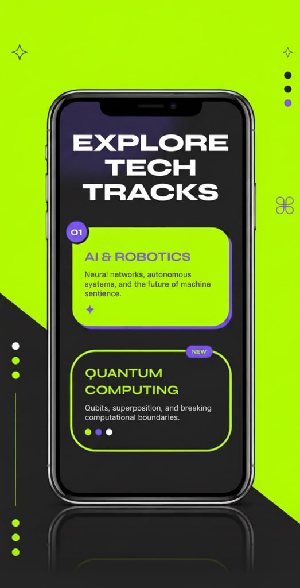
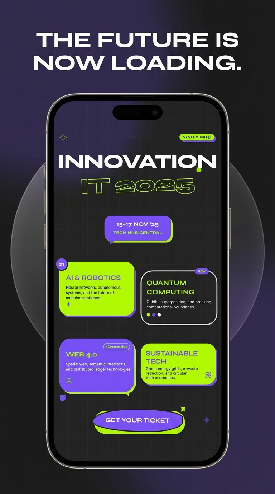

# ⚡ Innovation IT 2025

A bold neon landing-page concept for a fictional tech conference — neon-lime & purple, blob shapes, speech bubbles, floating animations and a mouse-parallax background. A single self-contained file built with Tailwind CSS via CDN.


> **View it live:** https://evelinvee.github.io/innovation-it-2025/ — a fixed-size desktop poster (1080px), best viewed on a wide screen.

---

## ✨ Highlights

- Eye-catching **brutalist / neon** aesthetic (lime + purple, hard solid shadows)
- Organic **blob shapes** and **speech-bubble** cards for the conference tracks
- **Floating** decorative elements, animated data-grid background, and a **mouse-parallax** glow
- Scroll-reveal animations via `IntersectionObserver`
- **Responsive** layout (CSS grid) that respects `prefers-reduced-motion`
- Built with **Tailwind CSS** (CDN) + Google Fonts (Syne / Inter) — no build step

<div align="center">

&nbsp;&nbsp;

</div>

## ▶️ View it

- **Live:** https://evelinvee.github.io/innovation-it-2025/
- **Locally:** download `index.html` and open it in any modern browser.

## 🗂️ Structure

```
index.html    # the landing page (HTML + Tailwind + a little JS)
mockups/      # preview images
README.md
LICENSE
```

## 🛠️ Tech

HTML + **Tailwind CSS** (via CDN) + a little vanilla JavaScript for scroll reveals and parallax. Single file, nothing to install.

## 📄 License

MIT © [evelinvee](https://github.com/evelinvee)
